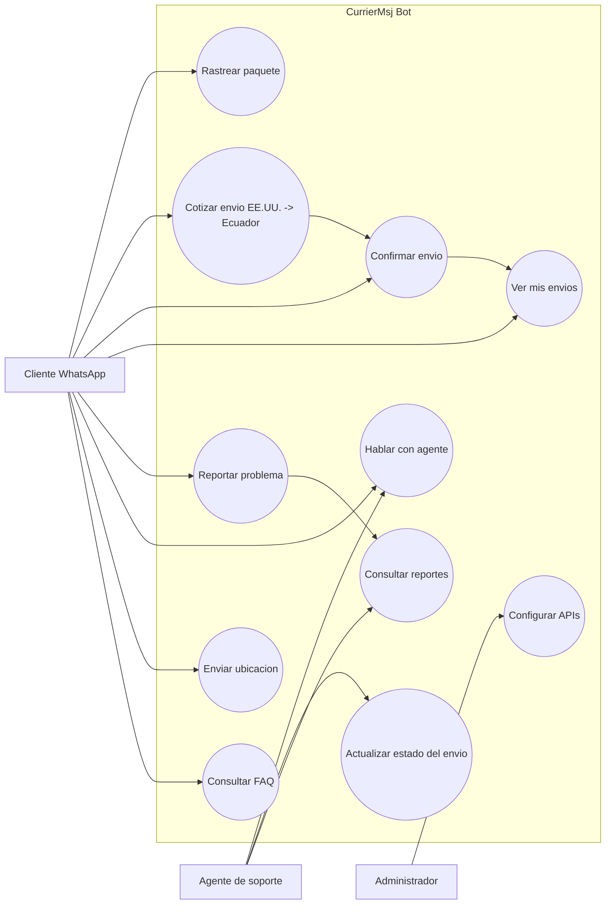
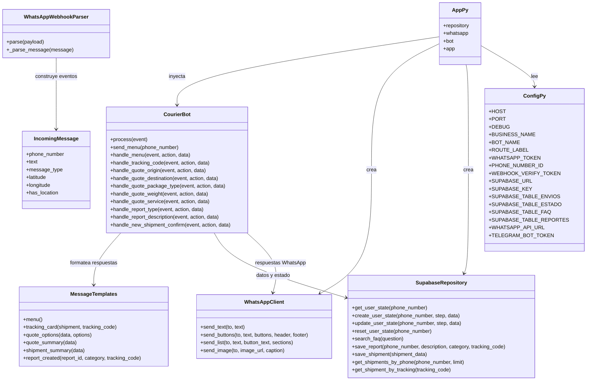
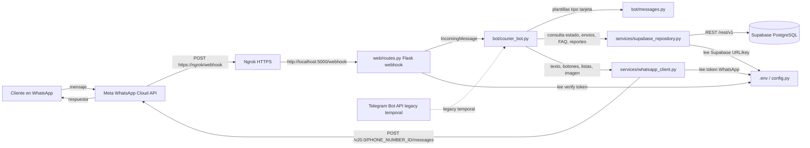
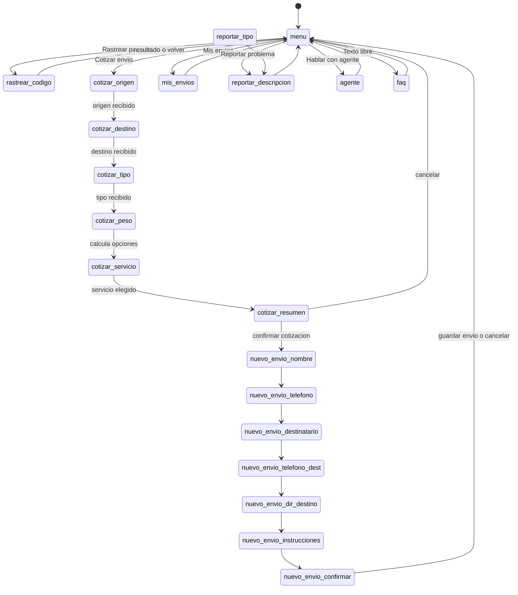
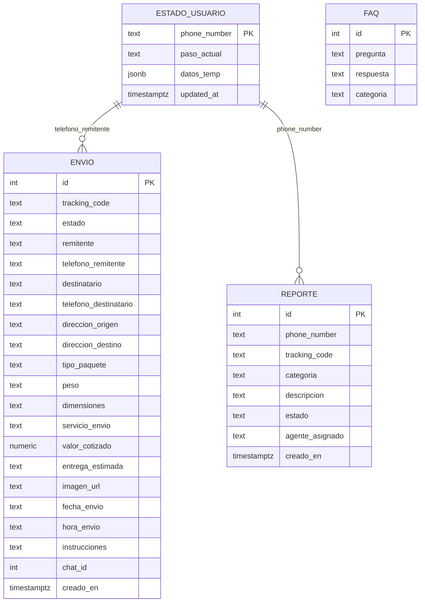

# CurrierMsj - Bot courier EE.UU. -> Ecuador

Sistema de atencion y registro de envios para paquetes que viajan desde Estados Unidos hacia Ecuador. El canal principal es WhatsApp Business Cloud API, el backend es Flask y los datos se guardan en Supabase. Telegram queda como soporte legacy temporal y se puede eliminar despues.

## Que hace el sistema

- Atiende mensajes entrantes de WhatsApp por `/webhook`.
- Muestra un menu con opciones para rastrear, cotizar, ver envios, reportar problemas y hablar con un agente.
- Cotiza paquetes EE.UU. -> Ecuador segun tipo y peso.
- Registra envios confirmados en Supabase.
- Genera codigos tipo `CUR-00001`.
- Guarda el estado de conversacion por numero de telefono.
- Usa ngrok en desarrollo para exponer Flask con HTTPS.
- Deja documentado Telegram como API legacy temporal.

## Diagrama de casos de uso



## Diagrama de clases / modulos

El bot ahora esta separado por capas. `app.py` solo arma dependencias; la logica vive en clases y carpetas dedicadas.



## Como esta conectado todo



Flujo resumido:

1. El cliente escribe al numero de WhatsApp.
2. Meta envia el mensaje al webhook publico de ngrok.
3. ngrok lo redirige a `http://localhost:5000/webhook`.
4. `web/routes.py` convierte el webhook en un `IncomingMessage`.
5. `bot/courier_bot.py` decide el siguiente paso del flujo.
6. `services/supabase_repository.py` lee o actualiza Supabase.
7. `services/whatsapp_client.py` responde usando WhatsApp Cloud API.
8. El cliente recibe el mensaje en WhatsApp.

## Flujo del bot



## Tablas que debes crear en Supabase

El sistema usa estas tablas:

- `envios`: envios reales y tracking.
- `estado_usuario`: paso actual del cliente dentro del bot.
- `faq`: preguntas frecuentes que responde el bot.
- `reportes`: problemas reportados por clientes.

### Modelo entidad relacion



### SQL recomendado para Supabase

En Supabase entra a `SQL Editor` y ejecuta esto. Tambien puedes guardar esta estructura en `bot-mensajeria/supabase_schema.sql`.

```sql
CREATE TABLE IF NOT EXISTS envios (
    id SERIAL PRIMARY KEY,
    tracking_code TEXT UNIQUE,
    estado TEXT NOT NULL DEFAULT 'pendiente',
    remitente TEXT,
    telefono_remitente TEXT,
    destinatario TEXT,
    telefono_destinatario TEXT,
    direccion_origen TEXT,
    direccion_destino TEXT,
    tipo_paquete TEXT,
    peso TEXT,
    dimensiones TEXT,
    servicio_envio TEXT,
    valor_cotizado NUMERIC(10,2),
    entrega_estimada TEXT,
    imagen_url TEXT,
    fecha_envio TEXT,
    hora_envio TEXT,
    instrucciones TEXT,
    chat_id INTEGER DEFAULT 0,
    creado_en TIMESTAMPTZ DEFAULT NOW()
);

CREATE TABLE IF NOT EXISTS estado_usuario (
    phone_number TEXT PRIMARY KEY,
    paso_actual TEXT NOT NULL DEFAULT 'menu',
    datos_temp JSONB DEFAULT '{}',
    updated_at TIMESTAMPTZ DEFAULT NOW()
);

CREATE TABLE IF NOT EXISTS faq (
    id SERIAL PRIMARY KEY,
    pregunta TEXT NOT NULL,
    respuesta TEXT NOT NULL,
    categoria TEXT DEFAULT 'general'
);

CREATE UNIQUE INDEX IF NOT EXISTS faq_pregunta_unique ON faq (pregunta);

CREATE TABLE IF NOT EXISTS reportes (
    id SERIAL PRIMARY KEY,
    phone_number TEXT NOT NULL,
    tracking_code TEXT,
    categoria TEXT,
    descripcion TEXT NOT NULL,
    estado TEXT DEFAULT 'abierto',
    agente_asignado TEXT DEFAULT 'Equipo soporte',
    creado_en TIMESTAMPTZ DEFAULT NOW()
);

CREATE OR REPLACE FUNCTION generar_tracking_code()
RETURNS TRIGGER AS $$
BEGIN
    IF NEW.tracking_code IS NULL OR NEW.tracking_code = '' THEN
        NEW.tracking_code := 'CUR-' || LPAD(NEW.id::TEXT, 5, '0');
    END IF;
    RETURN NEW;
END;
$$ LANGUAGE plpgsql;

DROP TRIGGER IF EXISTS trg_tracking ON envios;
CREATE TRIGGER trg_tracking
    BEFORE INSERT ON envios
    FOR EACH ROW
    EXECUTE FUNCTION generar_tracking_code();

UPDATE envios
SET tracking_code = 'CUR-' || LPAD(id::TEXT, 5, '0')
WHERE tracking_code IS NULL OR tracking_code = '';

CREATE UNIQUE INDEX IF NOT EXISTS envios_tracking_code_unique
    ON envios (tracking_code)
    WHERE tracking_code IS NOT NULL AND tracking_code <> '';

ALTER TABLE envios ENABLE ROW LEVEL SECURITY;
ALTER TABLE estado_usuario ENABLE ROW LEVEL SECURITY;
ALTER TABLE faq ENABLE ROW LEVEL SECURITY;
ALTER TABLE reportes ENABLE ROW LEVEL SECURITY;

DROP POLICY IF EXISTS "Service role acceso total envios" ON envios;
CREATE POLICY "Service role acceso total envios" ON envios
    FOR ALL USING (auth.role() = 'service_role');

DROP POLICY IF EXISTS "Service role acceso total estado_usuario" ON estado_usuario;
CREATE POLICY "Service role acceso total estado_usuario" ON estado_usuario
    FOR ALL USING (auth.role() = 'service_role');

DROP POLICY IF EXISTS "Service role acceso total faq" ON faq;
CREATE POLICY "Service role acceso total faq" ON faq
    FOR ALL USING (auth.role() = 'service_role');

DROP POLICY IF EXISTS "Anon lectura faq" ON faq;
CREATE POLICY "Anon lectura faq" ON faq
    FOR SELECT USING (true);

DROP POLICY IF EXISTS "Service role acceso total reportes" ON reportes;
CREATE POLICY "Service role acceso total reportes" ON reportes
    FOR ALL USING (auth.role() = 'service_role');

INSERT INTO faq (pregunta, respuesta, categoria) VALUES
    ('horario', 'Nuestro horario de atencion es de Lunes a Sabado de 8:00 a 18:00.', 'general'),
    ('costo', 'El costo depende del peso y la ruta. Usa la opcion Cotizar envio para obtener un estimado.', 'envios'),
    ('tiempo entrega', 'El tiempo estimado EE.UU. a Ecuador depende del servicio y aduana.', 'envios'),
    ('formas pago', 'Aceptamos efectivo, transferencia bancaria y pago acordado con el agente.', 'pagos'),
    ('cobertura', 'La ruta principal del servicio es Estados Unidos hacia Ecuador.', 'general'),
    ('abono', 'Puedes coordinar abono o pago completo con el agente antes del envio.', 'pagos')
ON CONFLICT (pregunta) DO UPDATE SET
    respuesta = EXCLUDED.respuesta,
    categoria = EXCLUDED.categoria;
```

Importante: para el bot usa la `service_role key`, no la `anon key`, porque el backend necesita insertar y actualizar registros.

## Variables de entorno

Crea el archivo `bot-mensajeria/.env`. No subas este archivo a Git.

```env
WHATSAPP_TOKEN=EAAxxxxxxxxxxxxxxxxxxxxxxxx
PHONE_NUMBER_ID=123456789012345
WEBHOOK_VERIFY_TOKEN=curriermsj_secret

SUPABASE_URL=https://tu-proyecto.supabase.co
SUPABASE_KEY=eyJxxxxxxxxxxxxxxxxxxxxxxxx

URL_GOOGLE_SHEETS=

# Legacy temporal. El codigo actual ya esta migrado a WhatsApp,
# pero se deja documentado por si se restaura un bot Telegram antiguo.
TELEGRAM_BOT_TOKEN=123456:ABCxxxxxxxxxxxxxxxx
```

Donde conseguir cada valor:

| Variable | Donde se cambia | Donde se consigue |
|---|---|---|
| `WHATSAPP_TOKEN` | `bot-mensajeria/.env` | Meta Developers -> WhatsApp -> API Setup -> Access Token |
| `PHONE_NUMBER_ID` | `bot-mensajeria/.env` | Meta Developers -> WhatsApp -> API Setup -> Phone Number ID |
| `WEBHOOK_VERIFY_TOKEN` | `bot-mensajeria/.env` | Lo defines tu; debe coincidir con Meta Webhook config |
| `SUPABASE_URL` | `bot-mensajeria/.env` | Supabase -> Project Settings -> API -> Project URL |
| `SUPABASE_KEY` | `bot-mensajeria/.env` | Supabase -> Project Settings -> API -> service_role key |
| `TELEGRAM_BOT_TOKEN` | `bot-mensajeria/.env` | BotFather en Telegram, solo si vuelves a activar Telegram |

## Configurar Supabase API

1. Crea un proyecto en Supabase.
2. Ve a `SQL Editor`.
3. Ejecuta el SQL de la seccion anterior o el archivo `bot-mensajeria/supabase_schema.sql`.
4. Ve a `Project Settings -> API`.
5. Copia `Project URL` en `SUPABASE_URL`.
6. Copia `service_role key` en `SUPABASE_KEY`.
7. Reinicia Flask despues de cambiar `.env`.

En el codigo, Supabase se configura aqui:

- `bot-mensajeria/config.py`: lee `SUPABASE_URL`, `SUPABASE_KEY` y los nombres de tablas.
- `bot-mensajeria/services/supabase_repository.py`: construye URLs REST como `/rest/v1/envios`.
- `bot-mensajeria/whatsapp_db.py`: queda como compatibilidad para imports antiguos.

## Configurar WhatsApp Business API

1. Entra a Meta Developers.
2. Crea una App o usa una existente.
3. Agrega el producto `WhatsApp`.
4. En `WhatsApp -> API Setup`, copia:
   - `Access Token` hacia `WHATSAPP_TOKEN`.
   - `Phone Number ID` hacia `PHONE_NUMBER_ID`.
5. En `WhatsApp -> Configuration -> Webhooks`, configura:
   - Callback URL: `https://TU-NGROK.ngrok-free.app/webhook`
   - Verify token: el mismo valor de `WEBHOOK_VERIFY_TOKEN`
6. Suscribe el evento `messages`.

En el codigo, WhatsApp se configura aqui:

- `bot-mensajeria/config.py`: `WHATSAPP_API_URL = "https://graph.facebook.com/v20.0"`.
- `bot-mensajeria/services/whatsapp_client.py`: envia texto, botones, listas e imagenes a Meta.
- `bot-mensajeria/web/routes.py`: `GET /webhook` verifica el webhook.
- `bot-mensajeria/web/routes.py`: `POST /webhook` recibe mensajes.

## Configurar ngrok

Instala ngrok y enlazalo con tu cuenta:

```bash
ngrok config add-authtoken TU_AUTHTOKEN
```

Corre Flask en una terminal:

```bash
cd bot-mensajeria
python app.py
```

Corre ngrok en otra terminal:

```bash
ngrok http 5000
```

ngrok te dara una URL parecida a:

```text
https://abc123.ngrok-free.app
```

En Meta Developers debes poner:

```text
https://abc123.ngrok-free.app/webhook
```

En plan gratis, la URL cambia cada vez que reinicias ngrok. Si cambia, actualiza el webhook en Meta.

## Ruta del paquete: EE.UU. -> Ecuador

El sistema esta pensado para envios desde Estados Unidos hacia Ecuador.

- La direccion de origen se guarda en `direccion_origen`.
- La direccion de destino en Ecuador se guarda en `direccion_destino`.
- Las tarifas base estan en `bot-mensajeria/domain/constants.py`, diccionario `BASE_QUOTES_USD`.
- Los servicios Express/Estandar/Economico estan en `bot-mensajeria/domain/constants.py`, diccionario `SHIPPING_SERVICES`.
- Si quieres bloquear otros destinos, valida en `handle_quote_destination` dentro de `bot-mensajeria/bot/courier_bot.py`.
- Si quieres manejar ciudades especificas de Ecuador, agrega una tabla `ciudades_cobertura` o una lista en codigo.

## Telegram Bot API legacy

Telegram queda documentado solo como soporte temporal. El codigo actual visible en este repo ya trabaja con WhatsApp (`app.py`) y no tiene `bot.py` activo.

Si necesitas reactivar Telegram momentaneamente:

1. Crea el bot con BotFather.
2. Copia el token en `TELEGRAM_BOT_TOKEN`.
3. Restaura el codigo Telegram antiguo (`bot.py`, handlers, servicios) desde historial Git si existe.
4. Mantelo separado del flujo WhatsApp.
5. Eliminalo cuando WhatsApp quede estable.

## Donde cambiar cada cosa

| Que quieres cambiar | Archivo |
|---|---|
| Token de WhatsApp | `bot-mensajeria/.env` -> `WHATSAPP_TOKEN` |
| Phone Number ID | `bot-mensajeria/.env` -> `PHONE_NUMBER_ID` |
| Verify token del webhook | `bot-mensajeria/.env` -> `WEBHOOK_VERIFY_TOKEN` |
| URL de Supabase | `bot-mensajeria/.env` -> `SUPABASE_URL` |
| Key de Supabase | `bot-mensajeria/.env` -> `SUPABASE_KEY` |
| Nombres de tablas | `bot-mensajeria/config.py` -> `SUPABASE_TABLE_*` |
| Version API WhatsApp | `bot-mensajeria/config.py` -> `WHATSAPP_API_URL` |
| Token Telegram temporal | `bot-mensajeria/.env` -> `TELEGRAM_BOT_TOKEN` y `bot-mensajeria/config.py` |
| Puerto local Flask | `bot-mensajeria/.env` -> `PORT` o `bot-mensajeria/config.py` |
| Nombre del negocio/bot | `bot-mensajeria/.env` -> `BUSINESS_NAME`, `BOT_NAME`, `ROUTE_LABEL` |
| Texto del menu y tarjetas | `bot-mensajeria/bot/messages.py` -> `MessageTemplates` |
| Botones del menu | `bot-mensajeria/bot/messages.py` -> `Buttons` |
| Precios EE.UU. -> Ecuador | `bot-mensajeria/domain/constants.py` -> `BASE_QUOTES_USD` |
| Servicios de envio | `bot-mensajeria/domain/constants.py` -> `SHIPPING_SERVICES` |
| Flujo de cotizacion | `bot-mensajeria/bot/courier_bot.py` -> `handle_quote_*` |
| Guardado de envios | `bot-mensajeria/services/supabase_repository.py` -> `save_shipment` |
| Busqueda de envios | `bot-mensajeria/services/supabase_repository.py` -> `get_shipment_by_tracking`, `get_shipments_by_phone` |
| SQL de tablas | `bot-mensajeria/supabase_schema.sql` |

## Ejecutar localmente

```bash
cd bot-mensajeria
python -m venv .venv
.venv\Scripts\activate
pip install -r requirements.txt
python app.py
```

En otra terminal:

```bash
ngrok http 5000
```

Prueba salud del servidor:

```text
https://TU-NGROK.ngrok-free.app/health
```

Debe responder algo como:

```json
{
  "status": "ok",
  "service": "currier_bot"
}
```

## Estructura del proyecto

```text
curriermsj/
|-- README.md
|-- registro.txt
|-- .gitignore
`-- bot-mensajeria/
    |-- README.md
    |-- app.py
    |-- config.py
    |-- whatsapp_db.py
    |-- bot/
    |   |-- courier_bot.py
    |   `-- messages.py
    |-- domain/
    |   |-- constants.py
    |   `-- models.py
    |-- services/
    |   |-- supabase_repository.py
    |   `-- whatsapp_client.py
    |-- web/
    |   `-- routes.py
    |-- requirements.txt
    `-- supabase_schema.sql
```

## Fases sugeridas

| Fase | Objetivo | Estado |
|---|---|---|
| 1 | WhatsApp + Supabase + ngrok para demo | Completado |
| 2 | Ajustar cotizaciones reales EE.UU. -> Ecuador | Pendiente |
| 3 | Panel administrativo para agentes | Pendiente |
| 4 | Eliminar Telegram legacy | Pendiente |
| 5 | Despliegue estable sin ngrok | Pendiente |
