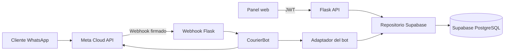
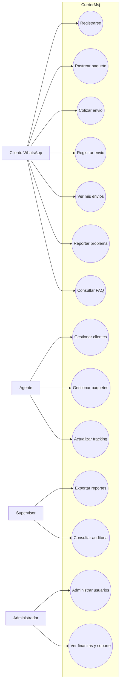
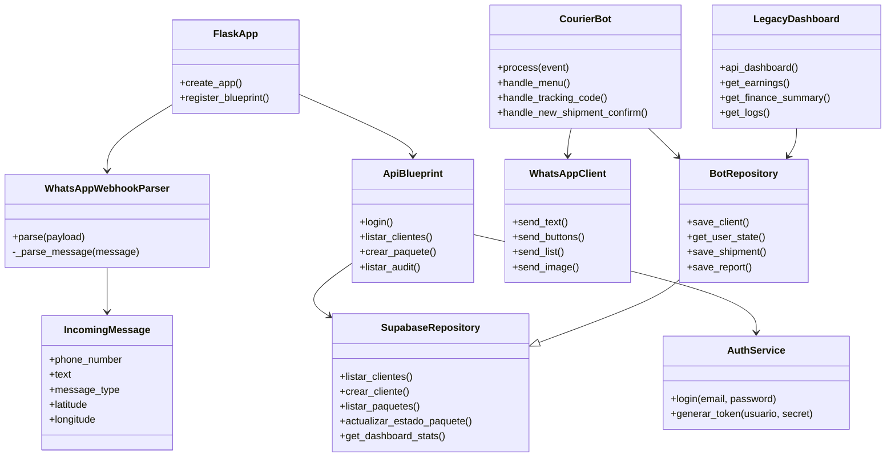
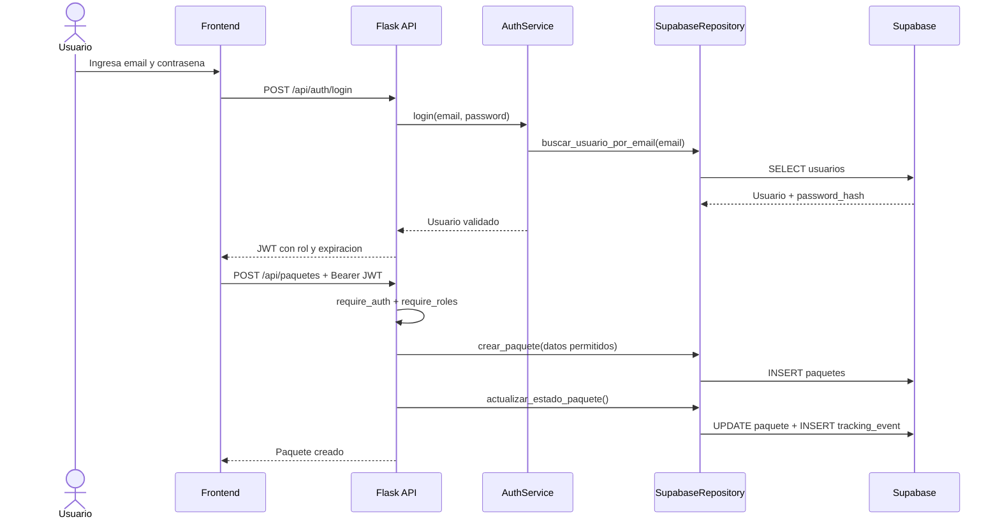
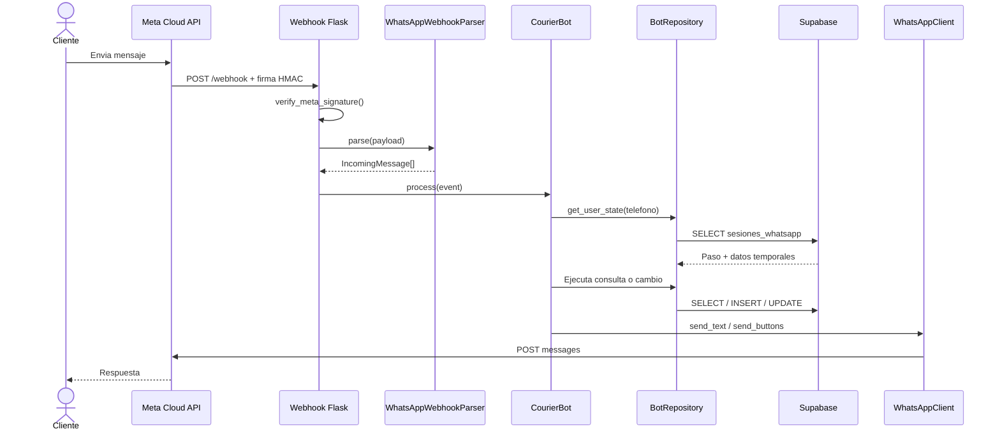
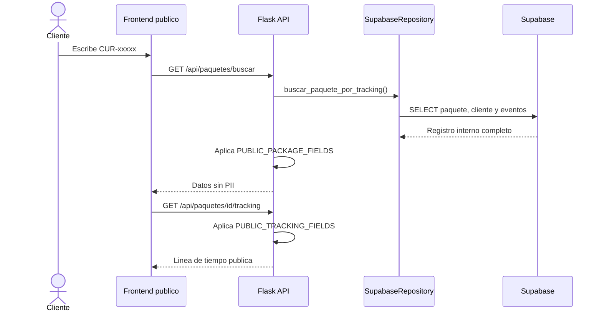
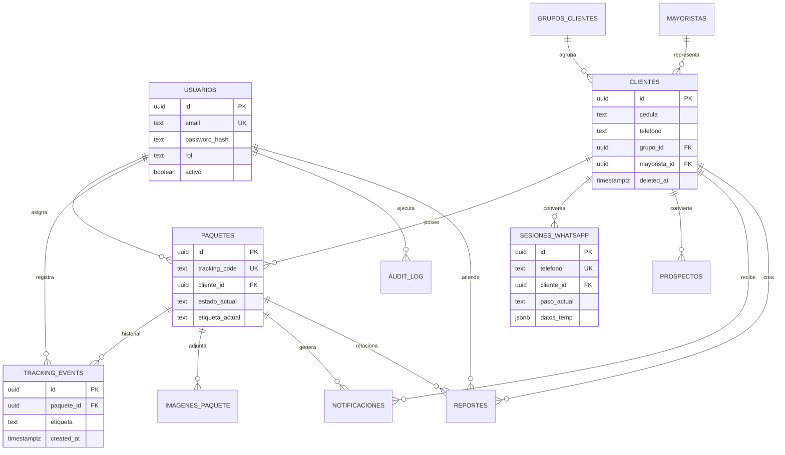
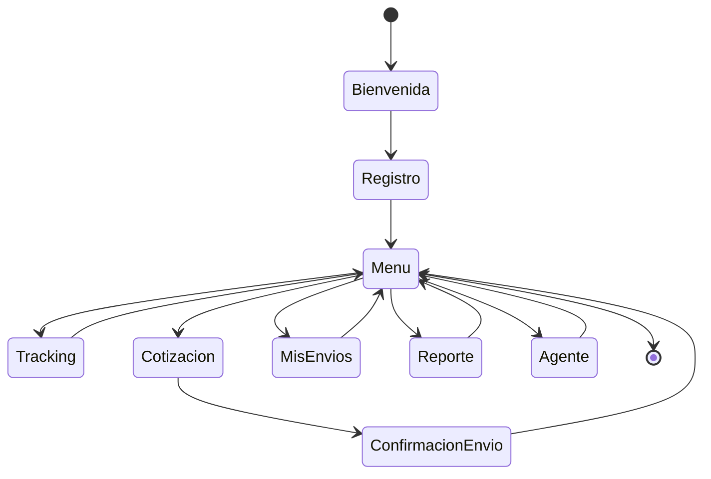

# CurrierMsj

CurrierMsj es una plataforma de gestion courier para envios entre Estados Unidos y Ecuador. Integra un panel web administrativo, una API Flask, Supabase/PostgreSQL y un bot conectado a WhatsApp Business Cloud API.

El repositorio conserva dos superficies completas. `run.py` inicia la plataforma unificada y `bot-mensajeria/app.py` inicia el panel operativo anterior con sus endpoints financieros, logs y pruebas. Ninguna de las dos se considera codigo descartable.

| Modo | Entrada | Interfaz | Autenticacion |
|---|---|---|---|
| Plataforma unificada | `run.py` | `frontend/index.html` | JWT y roles |
| Operacion legado | `bot-mensajeria/app.py` | `dashboard/owner.html` y `dashboard/support.html` | HTTP Basic configurable |
| Dashboard React | `dashboard/react.html` | Vite + React + Chakra UI | Proxy local o CORS exacto |

## Funcionalidades

- Login administrativo con JWT y permisos por rol.
- Dashboard con clientes, paquetes, estados, prospectos y sesiones activas.
- Registro, edicion, busqueda y eliminacion logica de clientes.
- Registro de paquetes y generacion automatica de codigos `CUR-xxxxx`.
- Historial de tracking y cambio de estados.
- Consulta publica de tracking sin exponer cedulas, telefonos ni notas internas.
- Exportacion autenticada de reportes CSV.
- Registro de auditoria para clientes y paquetes.
- Bot de WhatsApp con onboarding, tracking, cotizacion, reportes y registro de envios.
- Webhook validado mediante firma HMAC de Meta.
- Migracion de datos desde las tablas historicas.
- Indice local opcional con CodeGraph para navegar el codigo.
- Dashboard financiero de dueno, panel de soporte, logs y resultados de pruebas.
- Dashboard React modular para clientes, pendientes, reportes y observabilidad.
- Scripts de carga y borrado controlado de datos del esquema historico.

## Arquitectura


```mermaid
flowchart LR
    Browser[Panel web] -->|JWT| API[Flask API]
    Client[Cliente WhatsApp] --> Meta[Meta Cloud API]
    Meta -->|Webhook firmado| Webhook[Webhook Flask]
    Webhook --> Bot[CourierBot]
    API --> Repo[Repositorio Supabase]
    Bot --> Adapter[Adaptador del bot]
    Adapter --> Repo
    Repo --> DB[(Supabase PostgreSQL)]
    Bot --> Meta
```

### Capas activas

| Capa | Ubicacion | Responsabilidad |
|---|---|---|
| Entrada | `run.py` | Carga `.env`, crea Flask e inicia el servidor local |
| Configuracion | `backend/config/app.py` | Limites, CORS, cabeceras y registro de blueprints |
| API | `backend/interfaces/api.py` | Rutas HTTP, JWT, roles, validacion y serializacion |
| Webhook | `backend/interfaces/webhook.py` | Verificacion de Meta, firma HMAC y despacho al bot |
| Aplicacion | `backend/application/services.py` | Autenticacion y emision de JWT |
| Infraestructura | `backend/infrastructure/supabase_repository.py` | Consultas y persistencia unificada |
| Bot | `bot-mensajeria/bot/` | Estados de conversacion y reglas del asistente |
| Compatibilidad | `bot-mensajeria/services/supabase_repository.py` | Traduce el contrato historico del bot al esquema nuevo |
| Frontend | `frontend/index.html` | SPA administrativa con Alpine, Tailwind y Chart.js |
| Dashboards legado | `dashboard/` | Panel React y paneles HTML de dueno/soporte |
| Datos | `database/migrations/` | Esquema, funciones RPC, RLS e integridad |

### Flujos principales

Panel administrativo:

```text
Navegador -> POST /api/auth/login -> JWT -> API protegida -> Supabase
```

Tracking publico:

```text
Codigo CUR -> /api/paquetes/buscar -> respuesta publica filtrada
           -> /api/paquetes/<id>/tracking -> eventos publicos filtrados
```

WhatsApp:

```text
Meta -> POST /webhook -> valida X-Hub-Signature-256 -> parser -> CourierBot
     -> adaptador -> repositorio -> Supabase -> respuesta por Meta
```

## Diagramas del sistema

### Casos de uso


```mermaid
flowchart LR
    Cliente[Cliente WhatsApp]
    Agente[Agente]
    Supervisor[Supervisor]
    Admin[Administrador]

    subgraph CurrierMsj
        UC1((Registrarse))
        UC2((Rastrear paquete))
        UC3((Cotizar envio))
        UC4((Registrar envio))
        UC5((Ver mis envios))
        UC6((Reportar problema))
        UC7((Consultar FAQ))
        UC8((Gestionar clientes))
        UC9((Gestionar paquetes))
        UC10((Actualizar tracking))
        UC11((Exportar reportes))
        UC12((Consultar auditoria))
        UC13((Administrar usuarios))
        UC14((Ver finanzas y soporte))
    end

    Cliente --> UC1
    Cliente --> UC2
    Cliente --> UC3
    Cliente --> UC4
    Cliente --> UC5
    Cliente --> UC6
    Cliente --> UC7
    Agente --> UC8
    Agente --> UC9
    Agente --> UC10
    Supervisor --> UC11
    Supervisor --> UC12
    Admin --> UC13
    Admin --> UC14
```

### Diagrama de clases y modulos


```mermaid
classDiagram
    class FlaskApp {
        +create_app()
        +register_blueprint()
    }
    class ApiBlueprint {
        +login()
        +listar_clientes()
        +crear_paquete()
        +listar_audit()
    }
    class AuthService {
        +login(email, password)
        +generar_token(usuario, secret)
    }
    class SupabaseRepository {
        +listar_clientes()
        +crear_cliente()
        +listar_paquetes()
        +actualizar_estado_paquete()
        +get_dashboard_stats()
    }
    class BotRepository {
        +save_client()
        +get_user_state()
        +save_shipment()
        +save_report()
    }
    class CourierBot {
        +process(event)
        +handle_menu()
        +handle_tracking_code()
        +handle_new_shipment_confirm()
    }
    class WhatsAppClient {
        +send_text()
        +send_buttons()
        +send_list()
        +send_image()
    }
    class WhatsAppWebhookParser {
        +parse(payload)
        -_parse_message(message)
    }
    class IncomingMessage {
        +phone_number
        +text
        +message_type
        +latitude
        +longitude
    }
    class LegacyDashboard {
        +api_dashboard()
        +get_earnings()
        +get_finance_summary()
        +get_logs()
    }

    FlaskApp --> ApiBlueprint
    ApiBlueprint --> AuthService
    ApiBlueprint --> SupabaseRepository
    BotRepository --|> SupabaseRepository
    CourierBot --> BotRepository
    CourierBot --> WhatsAppClient
    WhatsAppWebhookParser --> IncomingMessage
    FlaskApp --> WhatsAppWebhookParser
    LegacyDashboard --> BotRepository
```

### Secuencia de login y operacion administrativa


```mermaid
sequenceDiagram
    actor Usuario
    participant UI as Frontend
    participant API as Flask API
    participant Auth as AuthService
    participant Repo as SupabaseRepository
    participant DB as Supabase

    Usuario->>UI: Ingresa email y contrasena
    UI->>API: POST /api/auth/login
    API->>Auth: login(email, password)
    Auth->>Repo: buscar_usuario_por_email(email)
    Repo->>DB: SELECT usuarios
    DB-->>Repo: Usuario + password_hash
    Auth-->>API: Usuario validado
    API-->>UI: JWT con rol y expiracion
    UI->>API: POST /api/paquetes + Bearer JWT
    API->>API: require_auth + require_roles
    API->>Repo: crear_paquete(datos permitidos)
    Repo->>DB: INSERT paquetes
    API->>Repo: actualizar_estado_paquete()
    Repo->>DB: UPDATE paquete + INSERT tracking_event
    API-->>UI: Paquete creado
```

### Secuencia de mensaje de WhatsApp


```mermaid
sequenceDiagram
    actor Cliente
    participant Meta as Meta Cloud API
    participant Hook as Webhook Flask
    participant Parser as WhatsAppWebhookParser
    participant Bot as CourierBot
    participant Repo as BotRepository
    participant DB as Supabase
    participant WA as WhatsAppClient

    Cliente->>Meta: Envia mensaje
    Meta->>Hook: POST /webhook + firma HMAC
    Hook->>Hook: verify_meta_signature()
    Hook->>Parser: parse(payload)
    Parser-->>Hook: IncomingMessage[]
    Hook->>Bot: process(event)
    Bot->>Repo: get_user_state(telefono)
    Repo->>DB: SELECT sesiones_whatsapp
    DB-->>Repo: Paso + datos temporales
    Bot->>Repo: Ejecuta consulta o cambio
    Repo->>DB: SELECT / INSERT / UPDATE
    Bot->>WA: send_text / send_buttons
    WA->>Meta: POST messages
    Meta-->>Cliente: Respuesta
```

### Secuencia de tracking publico


```mermaid
sequenceDiagram
    actor Cliente
    participant UI as Frontend publico
    participant API as Flask API
    participant Repo as SupabaseRepository
    participant DB as Supabase

    Cliente->>UI: Escribe CUR-xxxxx
    UI->>API: GET /api/paquetes/buscar
    API->>Repo: buscar_paquete_por_tracking()
    Repo->>DB: SELECT paquete, cliente y eventos
    DB-->>Repo: Registro interno completo
    API->>API: Aplica PUBLIC_PACKAGE_FIELDS
    API-->>UI: Datos sin PII
    UI->>API: GET /api/paquetes/id/tracking
    API->>API: Aplica PUBLIC_TRACKING_FIELDS
    API-->>UI: Linea de tiempo publica
```

### Modelo entidad-relacion


```mermaid
erDiagram
    USUARIOS ||--o{ PAQUETES : asigna
    USUARIOS ||--o{ TRACKING_EVENTS : registra
    USUARIOS ||--o{ AUDIT_LOG : ejecuta
    USUARIOS ||--o{ REPORTES : atiende
    GRUPOS_CLIENTES ||--o{ CLIENTES : agrupa
    MAYORISTAS ||--o{ CLIENTES : representa
    CLIENTES ||--o{ PAQUETES : posee
    CLIENTES ||--o{ SESIONES_WHATSAPP : conversa
    CLIENTES ||--o{ PROSPECTOS : convierte
    CLIENTES ||--o{ NOTIFICACIONES : recibe
    CLIENTES ||--o{ REPORTES : crea
    PAQUETES ||--o{ TRACKING_EVENTS : historial
    PAQUETES ||--o{ IMAGENES_PAQUETE : adjunta
    PAQUETES ||--o{ NOTIFICACIONES : genera
    PAQUETES ||--o{ REPORTES : relaciona

    USUARIOS {
        uuid id PK
        text email UK
        text password_hash
        text rol
        boolean activo
    }
    CLIENTES {
        uuid id PK
        text cedula
        text telefono
        uuid grupo_id FK
        uuid mayorista_id FK
        timestamptz deleted_at
    }
    PAQUETES {
        uuid id PK
        text tracking_code UK
        uuid cliente_id FK
        text estado_actual
        text etiqueta_actual
    }
    TRACKING_EVENTS {
        uuid id PK
        uuid paquete_id FK
        text etiqueta
        timestamptz created_at
    }
    SESIONES_WHATSAPP {
        uuid id PK
        text telefono UK
        uuid cliente_id FK
        text paso_actual
        jsonb datos_temp
    }
```

### Estados conversacionales del bot


```mermaid
stateDiagram-v2
    [*] --> Bienvenida
    Bienvenida --> Registro
    Registro --> Menu
    Menu --> Tracking
    Menu --> Cotizacion
    Menu --> MisEnvios
    Menu --> Reporte
    Menu --> Agente
    Tracking --> Menu
    Cotizacion --> ConfirmacionEnvio
    ConfirmacionEnvio --> Menu
    MisEnvios --> Menu
    Reporte --> Menu
    Agente --> Menu
    Menu --> [*]
```

## Estructura

```text
curriermsj/
|-- backend/
|   |-- application/services.py
|   |-- config/app.py
|   |-- infrastructure/supabase_repository.py
|   `-- interfaces/
|       |-- api.py
|       `-- webhook.py
|-- bot-mensajeria/
|   |-- bot/
|   |-- domain/
|   |-- services/
|   |-- tests/
|   `-- web/
|-- database/
|   |-- create_admin.py
|   |-- migrate_old_data.py
|   `-- migrations/
|-- frontend/
|   |-- index.html
|   `-- lib/
|-- dashboard/
|   |-- react.html
|   |-- owner.html
|   |-- support.html
|   |-- public/dashboard-assets/safe-html.js
|   |-- package.json
|   `-- src/
|-- docs/ARCHITECTURE.md
|-- cargar_datos_prueba.bat
|-- borrar_datos.bat
|-- run_tests.bat
|-- .env.example
|-- iniciar.bat
`-- run.py
```

## Requisitos

- Python 3.12 o superior.
- Un proyecto Supabase/PostgreSQL.
- Una aplicacion de Meta con WhatsApp Business si se usara el bot.
- ngrok u otro tunel HTTPS solo para webhooks en desarrollo.

## Inicio rapido en Windows

1. Crea la configuracion local:

```powershell
Copy-Item .env.example .env
```

2. Genera un secreto JWT y guardalo en `JWT_SECRET` dentro de `.env`:

```powershell
py -3 -c "import secrets; print(secrets.token_urlsafe(48))"
```

3. Completa al menos `SUPABASE_URL`, `SUPABASE_SERVICE_KEY`, `JWT_SECRET`, `WEBHOOK_VERIFY_TOKEN` y `META_APP_SECRET`. Si usaras el panel legado, define tambien `LEGACY_DASHBOARD_USER` y `LEGACY_DASHBOARD_PASSWORD`.

4. Aplica las migraciones SQL y crea el primer administrador como se explica mas abajo.

5. Inicia el sistema:

```powershell
.\iniciar.bat
```

`iniciar.bat` crea `.venv` si hace falta, instala las dependencias y abre `http://localhost:5000`. Por seguridad no inicia ngrok salvo que `START_NGROK=1` este definido en `.env`.

## Instalacion manual

Windows PowerShell:

```powershell
py -3 -m venv .venv
.\.venv\Scripts\python.exe -m pip install --upgrade pip
.\.venv\Scripts\python.exe -m pip install -r backend\requirements.txt
Copy-Item .env.example .env
.\.venv\Scripts\python.exe run.py
```

Linux o macOS:

```bash
python3 -m venv .venv
. .venv/bin/activate
python -m pip install --upgrade pip
python -m pip install -r backend/requirements.txt
cp .env.example .env
python run.py
```

La direccion local predeterminada es `http://127.0.0.1:5000`.

## Variables de entorno

| Variable | Obligatoria | Uso |
|---|---:|---|
| `SUPABASE_URL` | Si | URL del proyecto Supabase |
| `SUPABASE_SERVICE_KEY` | Si en backend | Clave `service_role`; preferida por el repositorio |
| `SUPABASE_KEY` | Compatibilidad | Fallback historico; nunca debe llegar al navegador |
| `JWT_SECRET` | Si | Firma JWT; minimo 32 caracteres |
| `WHATSAPP_TOKEN` | Para WhatsApp | Token de acceso de Meta |
| `PHONE_NUMBER_ID` | Para WhatsApp | Identificador del numero en Meta |
| `WHATSAPP_API_VERSION` | Para WhatsApp | Version activa indicada por Meta, por ejemplo `vXX.X` |
| `WEBHOOK_VERIFY_TOKEN` | Para WhatsApp | Token privado elegido por el operador |
| `META_APP_SECRET` | Para WhatsApp | App Secret usado para validar `X-Hub-Signature-256` |
| `LEGACY_DASHBOARD_USER` | Solo modo legado | Usuario HTTP Basic para paneles y endpoints historicos |
| `LEGACY_DASHBOARD_PASSWORD` | Solo modo legado | Contrasena HTTP Basic; minimo 12 caracteres |
| `CORS_ORIGINS` | No | Origenes permitidos separados por coma; vacio significa mismo origen |
| `MAX_CONTENT_LENGTH` | No | Limite de request en bytes; predeterminado 1 MiB |
| `HOST` | No | Host local; predeterminado `127.0.0.1` |
| `PORT` | No | Puerto; predeterminado `5000` |
| `FLASK_DEBUG` | No | `1` solo durante desarrollo local |
| `START_NGROK` | No | `1` permite que `iniciar.bat` abra el tunel |

Nunca subas `.env`, claves `service_role`, tokens de Meta ni contrasenas. `.env` esta excluido por Git.

## Base de datos

### Instalacion nueva

Ejecuta estos archivos en orden desde Supabase SQL Editor:

1. `database/migrations/001_initial_schema.sql`
2. `database/migrations/002_rpc_paquetes_por_estado.sql`
3. `database/migrations/003_rpc_dashboard_stats.sql`
4. `database/migrations/004_security_and_integrity.sql`

Con `psql` tambien puedes usar:

```powershell
psql "$env:DATABASE_URL" -v ON_ERROR_STOP=1 -f database/migrations/001_initial_schema.sql
psql "$env:DATABASE_URL" -v ON_ERROR_STOP=1 -f database/migrations/002_rpc_paquetes_por_estado.sql
psql "$env:DATABASE_URL" -v ON_ERROR_STOP=1 -f database/migrations/003_rpc_dashboard_stats.sql
psql "$env:DATABASE_URL" -v ON_ERROR_STOP=1 -f database/migrations/004_security_and_integrity.sql
```

### Base existente

Haz un respaldo antes de migrar. Aplica `002`, `003` y `004` si todavia no existen en la base. La migracion `004` agrega integridad para clientes activos, tablas `reportes` y `faq`, y RLS a todas las tablas auxiliares.

Los indices unicos activos fallaran de forma segura si ya existen cedulas o telefonos duplicados. Revisa antes:

```sql
SELECT cedula, COUNT(*)
FROM clientes
WHERE deleted_at IS NULL
GROUP BY cedula
HAVING COUNT(*) > 1;

SELECT telefono, COUNT(*)
FROM clientes
WHERE deleted_at IS NULL
GROUP BY telefono
HAVING COUNT(*) > 1;
```

Resuelve los duplicados antes de volver a ejecutar `004`.

### Modelo relacional y 3FN

El esquema mantiene entidades separadas para evitar grupos repetidos y dependencias transitivas:

| Area | Tablas |
|---|---|
| Acceso | `usuarios` |
| Clientes | `clientes`, `grupos_clientes`, `mayoristas`, `prospectos` |
| Operacion | `paquetes`, `tracking_events`, `imagenes_paquete`, `etiquetas_estado` |
| Comunicacion | `sesiones_whatsapp`, `notificaciones`, `faq`, `reportes` |
| Control | `configuracion`, `audit_log`, `reportes_generados` |

La base sigue 3FN de forma practica. Hay dos desnormalizaciones deliberadas:

- `paquetes` conserva remitente, destinatario y direcciones como fotografia historica del envio. Cambiar un cliente no debe reescribir documentos anteriores.
- `estado_actual` y `etiqueta_actual` son una cache del ultimo evento de tracking para listar y agrupar paquetes sin recalcular todo el historial.

Las relaciones principales usan UUID y claves foraneas. `reportes` usa `BIGSERIAL` porque el numero se muestra al cliente como identificador corto de soporte.

### Primer administrador

No existe un endpoint publico para crear administradores. Tras aplicar el esquema ejecuta:

```powershell
.\.venv\Scripts\python.exe -m database.create_admin --email admin@empresa.com --name "Administrador"
```

La contrasena se solicita dos veces sin mostrarse y debe tener al menos 12 caracteres.

### Migrar datos historicos

Con respaldo verificado y las variables de Supabase configuradas:

```powershell
.\.venv\Scripts\python.exe database\migrate_old_data.py
```

El script convierte `envios` en `clientes`, `paquetes` y `tracking_events`. Es idempotente por codigo de tracking, pero debe probarse primero sobre una copia de la base.

### Datos de prueba y mantenimiento legado

Se conservaron las herramientas historicas porque siguen siendo utiles para probar los paneles anteriores:

| Archivo | Funcion | Alcance |
|---|---|---|
| `cargar_datos_prueba.bat` | Ejecuta `bot-mensajeria/cargar_datos_prueba.py` | Inserta datos de demostracion en el esquema legado |
| `bot-mensajeria/supabase_schema.sql` | Crea las tablas historicas del bot y dashboard | Solo instalaciones que aun usan `envios` y `estado_usuario` |
| `borrar_datos.bat` | Elimina registros y restaura la FAQ base | Destructivo; solo esquema legado |

Antes de usar cualquiera de esos scripts:

1. Confirma si la base usa el esquema legado o las migraciones unificadas.
2. Crea y verifica un respaldo recuperable.
3. Revisa que `bot-mensajeria/.env` apunte al proyecto correcto.
4. No ejecutes `borrar_datos.bat` en produccion. El script exige escribir `BORRAR`, pero esa confirmacion no sustituye un backup.

Para una instalacion nueva usa `database/migrations/`; `supabase_schema.sql` se conserva por compatibilidad, no como reemplazo de esas migraciones.

## Configurar WhatsApp

1. Crea o abre una aplicacion en Meta Developers.
2. Agrega WhatsApp Business Cloud API.
3. Copia el token en `WHATSAPP_TOKEN`.
4. Copia el Phone Number ID en `PHONE_NUMBER_ID`.
5. Copia el App Secret de la aplicacion en `META_APP_SECRET`.
6. Define un valor aleatorio propio para `WEBHOOK_VERIFY_TOKEN`.
7. Publica localmente solo si es necesario, por ejemplo con `START_NGROK=1`.
8. Configura en Meta la callback `https://TU_HOST/webhook` y el mismo verify token.
9. Suscribe el evento `messages`.

Rutas del webhook:

| Metodo | Ruta | Proposito |
|---|---|---|
| `GET` | `/webhook` | Verificacion inicial de Meta |
| `POST` | `/webhook` | Mensajes y estados firmados |

El `POST` rechaza requests sin una firma `X-Hub-Signature-256` valida. No uses un valor predeterminado para ningun secreto.

## API

Todas las respuestas JSON usan esta forma:

```json
{
  "ok": true,
  "data": {}
}
```

Los errores usan:

```json
{
  "ok": false,
  "error": "Mensaje seguro"
}
```

### Rutas publicas

| Metodo | Ruta | Descripcion |
|---|---|---|
| `POST` | `/api/auth/login` | Autentica y entrega un JWT de 8 horas |
| `GET` | `/api/paquetes/buscar?tracking=CUR-xxxxx` | Datos publicos filtrados del paquete |
| `GET` | `/api/paquetes/<id>/tracking` | Historial publico filtrado |
| `GET` | `/api/health` | Estado basico sin detalles internos |

### Rutas autenticadas

| Area | Rutas principales |
|---|---|
| Dashboard | `GET /api/dashboard` |
| Clientes | `GET/POST /api/clientes`, `GET/PUT/DELETE /api/clientes/<id>` |
| Paquetes | `GET/POST /api/paquetes`, `GET /api/paquetes/<id>`, `PUT /api/paquetes/<id>/estado` |
| Operacion | `GET /api/etiquetas`, `/api/prospectos`, `/api/sesiones`, `/api/notificaciones` |
| Configuracion | `GET /api/config`, `GET/PUT /api/config/<clave>` |
| Usuarios | `GET/POST /api/usuarios` |
| Reportes | `GET /api/reportes/paquetes`, `GET /api/reportes/clientes` |
| Auditoria | `GET /api/audit` |

Usa el token asi:

```http
Authorization: Bearer <jwt>
```

### Rutas del modo legado

Al ejecutar `bot-mensajeria/app.py` se mantienen las interfaces y APIs originales. Todas las rutas de esta tabla requieren HTTP Basic con `LEGACY_DASHBOARD_USER` y `LEGACY_DASHBOARD_PASSWORD`:

| Metodo | Ruta | Funcion |
|---|---|---|
| `GET` | `/dashboard` | Panel financiero y operativo del dueno |
| `GET` | `/dashboard/soporte` | Panel de soporte |
| `GET` | `/dashboard-assets/<archivo>` | Recursos compartidos y protegidos de los paneles |
| `GET` | `/api/dashboard` | KPIs, sesiones, envios recientes y estado de servicios |
| `GET` | `/api/envios` | Envios del esquema historico |
| `GET` | `/api/system-stats` | Clientes, estados conversacionales y reportes |
| `GET` | `/api/earnings` | Ingresos acumulados por periodo |
| `GET` | `/api/finance-summary` | Flujo de caja, gastos, planilla y margenes |
| `GET` | `/api/logs` | Ultimas lineas del registro del bot |
| `GET` | `/api/test-results` | Resultado generado por `run_tests.bat` |

`GET /health` permanece publico para monitoreo. `GET /webhook` y `POST /webhook` conservan el contrato de Meta; el `POST` exige la firma HMAC valida.

### Roles

| Accion | admin | supervisor | agente | soporte |
|---|:---:|:---:|:---:|:---:|
| Ver dashboard y listados | Si | Si | Si | Si |
| Crear o editar clientes y paquetes | Si | Si | Si | No |
| Cambiar estado de paquetes | Si | Si | Si | No |
| Eliminar clientes | Si | Si | No | No |
| Exportar reportes y ver auditoria | Si | Si | No | No |
| Administrar configuracion y usuarios | Si | No | No | No |

## Seguridad

Controles incluidos:

- JWT HS256 con secreto obligatorio de 32 caracteres o mas.
- Tokens con `sub`, `iat`, `exp` y duracion de 8 horas.
- Usuarios inactivos no pueden iniciar sesion.
- Limite local de cinco logins fallidos por IP por minuto.
- Autorizacion por rol en operaciones sensibles.
- HTTP Basic obligatorio y sin valores predeterminados para paneles y APIs del modo legado.
- Allowlist de campos para impedir mass assignment.
- Respuesta publica de tracking con allowlist separada y sin PII.
- Firma HMAC SHA-256 obligatoria en webhooks de Meta.
- Comparacion constante de tokens y firmas.
- CORS deshabilitado por defecto y configurable por origen exacto.
- Limite predeterminado de 1 MiB por request.
- Cabeceras `nosniff`, `DENY`, Referrer Policy, Permissions Policy y HSTS bajo HTTPS.
- Errores internos registrados en servidor, no enviados al cliente.
- CSV protegido contra celdas que Excel podria interpretar como formulas.
- JWT del panel almacenado en `sessionStorage`, no de forma persistente.
- RLS habilitado en todas las tablas; acceso directo reservado a `service_role`.
- Funciones RPC restringidas a `service_role` y con `search_path` fijo.
- Dependencias frontend externas fijadas a versiones concretas.
- Datos dinamicos del dashboard legado escapados y filtrados con una allowlist DOM compartida.

Limites que deben reforzarse en produccion:

- El limite de login es por proceso. Agrega rate limiting en el proxy, WAF o gateway para multiples workers.
- El codigo de tracking funciona como dato de acceso publico. Debe ser dificil de adivinar y no debe compartirse fuera del destinatario.
- Usa TLS real, rotacion de secretos, backups cifrados y registros sin datos sensibles.
- Nunca ejecutes Flask con `FLASK_DEBUG=1` fuera de una maquina local.

## Frontend

Ninguna interfaz fue reemplazada o eliminada. El repositorio mantiene tres opciones para necesidades distintas:

| Interfaz | Archivos | Como se ejecuta | Uso |
|---|---|---|---|
| Panel unificado | `frontend/index.html` | Se sirve al ejecutar `run.py` | Administracion con JWT y roles |
| Paneles HTML legado | `dashboard/owner.html`, `dashboard/support.html` | Se sirven al ejecutar `bot-mensajeria/app.py` | Finanzas, soporte, logs y pruebas con HTTP Basic |
| Dashboard React | `dashboard/src/` | Vite en un proceso separado | Clientes, pendientes, reportes y observabilidad |

El panel unificado usa AlpineJS local, Tailwind CSS precompilado local, Chart.js `4.5.1` y Lucide `1.24.0`. Los datos de la API se muestran con `x-text`, no se interpolan como HTML, y los reportes se descargan mediante `fetch` autenticado.

Los paneles HTML historicos conservan sus tablas y tarjetas, pero todo contenido procedente de Supabase, logs o resultados de pruebas pasa por `dashboard/public/dashboard-assets/safe-html.js`. El modulo escapa interpolaciones y permite solo las etiquetas y atributos que usa la interfaz.

Para ejecutar el dashboard React:

```powershell
Copy-Item dashboard\.env.example dashboard\.env.local
npm install --prefix dashboard
npm run dev --prefix dashboard
```

Vite mantiene las dos interfaces restauradas:

- `http://127.0.0.1:5173/` abre el dashboard HTML historico.
- `http://127.0.0.1:5173/react.html` abre el dashboard React modular.
- `npm start --prefix dashboard` abre directamente la version React.

Durante desarrollo, Vite reenvia `/api` y `/health` a `http://127.0.0.1:5000`; por eso Flask debe estar iniciado. El proxy conserva el desafio HTTP Basic y evita incluir la contrasena en el bundle.

Para construir una version distribuible:

```powershell
npm run build --prefix dashboard
```

La compilacion produce `dist/index.html` y `dist/react.html`. En despliegue, el proxy inverso debe enviar `/api` al servidor Flask. Si se configura un backend absoluto mediante `VITE_BOT_HEALTH_URL`, agrega el origen exacto del dashboard a `CORS_ORIGINS`.

El dashboard React conserva su cliente Supabase propio en `dashboard/src/lib/supabaseClient.js`. `VITE_SUPABASE_ANON_KEY` admite solamente una clave publica protegida por RLS; nunca expongas una clave `service_role` en el frontend. Las credenciales `LEGACY_DASHBOARD_*` son exclusivas del proceso Flask y no son variables `VITE_*`.

## Bot

`CourierBot` mantiene una maquina de estados por telefono en `sesiones_whatsapp`. Sus flujos principales son:

- Registro inicial del cliente.
- Menu principal.
- Consulta de tracking.
- Cotizacion por tipo, peso y servicio.
- Registro de un envio.
- Consulta de envios propios.
- Creacion de un reporte de soporte.
- Consulta de preguntas frecuentes.

El adaptador genera una cedula provisional `WA-<telefono>` cuando el alta viene de WhatsApp y asocia el `cliente_id` a la sesion. Esto garantiza que un paquete nunca se inserte sin cliente.

## Pruebas y calidad

Instala herramientas de prueba:

```powershell
.\.venv\Scripts\python.exe -m pip install pytest pytest-mock ruff pip-audit
```

Suite completa:

```powershell
.\.venv\Scripts\python.exe -m pytest -q
```

Analisis estatico:

```powershell
.\.venv\Scripts\python.exe -m ruff check backend bot-mensajeria\services bot-mensajeria\bot database\migrate_old_data.py
.\.venv\Scripts\python.exe -m compileall -q backend bot-mensajeria database run.py
```

Auditoria de dependencias:

```powershell
.\.venv\Scripts\python.exe -m pip_audit -r backend\requirements.txt
npm audit --omit=dev --prefix dashboard
```

## CodeGraph

El indice `.codegraph/` es local y esta ignorado por Git. Para reconstruirlo:

```powershell
codegraph init
codegraph status
```

Ejemplos de consulta:

```powershell
codegraph explore "como llega un webhook hasta Supabase"
codegraph explore "quien llama actualizar_estado_paquete"
codegraph explore "impacto de cambiar el login JWT"
```

CodeGraph sincroniza el indice al cambiar archivos cuando su servidor esta activo.

Las reglas que deben seguir agentes y mantenedores estan versionadas en `AGENTS.md`. No agregues notas manuales dentro de `.codegraph/`: ese directorio es una cache regenerable y puede desaparecer al reconstruir el indice.

## Actualizacion integrada de julio de 2026

Esta version parte de `collab/main` hasta el commit `ad1502d`, que incorporo la arquitectura unificada, JWT, tracking publico, migracion del bot y el frontend administrativo. Sobre esa base se conservaron las funcionalidades historicas y se corrigieron problemas de integracion, seguridad, datos y documentacion.

La estrategia fue usar mayoritariamente la interfaz React nueva, por ser la superficie visual mas reciente, sin sustituir ni borrar los paneles HTML, scripts o endpoints que todavia cumplen funciones diferentes.

### Resumen de cambios

| Area | Actualizacion realizada | Archivos principales |
|---|---|---|
| Base remota | Integracion de los cambios `deaeb5c` y `ad1502d` desde `collab/main` | Todo el repositorio |
| Compatibilidad | Restauracion del dashboard completo, paneles de dueno/soporte, scripts, esquema historico, registro y pruebas | `dashboard/`, `bot-mensajeria/`, `registro.txt`, `run_tests.bat` |
| Servidor unificado | Validacion obligatoria de secretos, limites HTTP, CORS exacto y cabeceras defensivas | `run.py`, `backend/config/app.py` |
| Autenticacion | JWT de ocho horas, usuarios activos, roles, allowlists y limite de intentos de login | `backend/application/services.py`, `backend/interfaces/api.py` |
| API publica | Tracking filtrado para no devolver cedula, telefonos, direcciones privadas o notas internas | `backend/interfaces/api.py` |
| Webhook | Verify token sin valor predeterminado y firma HMAC SHA-256 de Meta obligatoria | `backend/security.py`, `backend/interfaces/webhook.py` |
| Modo legado | HTTP Basic configurable para dashboards, finanzas, logs, envios y resultados de pruebas | `bot-mensajeria/web/routes.py` |
| Seguridad compartida | Comparacion constante de secretos, HMAC y decorador de autenticacion reutilizados por ambos servidores | `backend/security.py` |
| Bot | Correccion de mapeos entre telefono, cliente, sesion, paquete, FAQ y reportes | `bot-mensajeria/bot/`, `bot-mensajeria/services/supabase_repository.py` |
| WhatsApp | Version de Graph API definida por entorno y validacion previa de credenciales | `bot-mensajeria/config.py`, `bot-mensajeria/services/whatsapp_client.py` |
| Panel unificado | JWT en `sessionStorage`, reportes autenticados, campos corregidos y dependencias CDN fijadas | `frontend/index.html` |
| Paneles HTML | Proteccion XSS, recursos compartidos autenticados, CDNs fijadas y retiro de IDs operativos escritos en HTML | `dashboard/index.html`, `dashboard/owner.html`, `dashboard/support.html` |
| Dashboard React | Entrada real `react.html`, rutas hash, proxy local, credenciales incluidas y carga diferida de vistas | `dashboard/react.html`, `dashboard/vite.config.js`, `dashboard/src/` |
| Sanitizacion | Escape de interpolaciones y allowlist DOM para datos, logs, reportes y resultados de pruebas | `dashboard/public/dashboard-assets/safe-html.js` |
| Base de datos | Esquema corregido, RLS, RPC restringidas, indices, integridad y migracion adicional | `database/migrations/001_initial_schema.sql` a `004_security_and_integrity.sql` |
| Administrador inicial | Creacion segura del primer usuario sin endpoint publico ni contrasena en argumentos | `database/create_admin.py` |
| Migracion historica | Conversion idempotente desde `envios` con campos compatibles con el modelo unificado | `database/migrate_old_data.py` |
| Datos de prueba | Restauracion del cargador, borrador controlado y SQL historico | `cargar_datos_prueba.bat`, `borrar_datos.bat`, `bot-mensajeria/supabase_schema.sql` |
| Codigo zombie | Eliminacion exclusiva de dos modulos duplicados y sin imports activos | `backend/config/settings.py`, `backend/domain/entities.py` |
| Calidad | Pruebas ampliadas para autenticacion, roles, firma Meta, CORS, repositorios y assets | `backend/tests/`, `bot-mensajeria/tests/` |
| Documentacion | README reconstruido, diagramas completos, arquitectura y protocolo de futuras actualizaciones | `README.md`, `docs/ARCHITECTURE.md`, `AGENTS.md` |

### Eliminaciones intencionales

Solo se eliminaron archivos completos despues de comprobar con CodeGraph y busqueda de imports que no participaban en ningun flujo:

| Archivo | Motivo |
|---|---|
| `backend/config/settings.py` | Configuracion duplicada con secretos y versiones predeterminadas inseguras; `backend/config/app.py` es la configuracion activa |
| `backend/domain/entities.py` | Dataclasses nunca importadas; API, bot y repositorios trabajan con los contratos reales de Supabase |

No uses esta lista como permiso para borrar otros archivos. Una entrada, pagina HTML, migracion, script, prueba o documento puede no tener callers estaticos y seguir siendo una superficie ejecutable o una herramienta operativa.

## Contratos que no deben romperse

Una actualizacion futura debe preservar estos contratos salvo que exista una migracion aprobada y documentada:

| Contrato | Regla |
|---|---|
| Entradas Python | `run.py` y `bot-mensajeria/app.py` deben seguir iniciando sus modos respectivos |
| Panel unificado | `frontend/index.html` debe conservar login JWT, roles, tracking, clientes, paquetes, reportes y auditoria |
| Paneles historicos | `/dashboard` y `/dashboard/soporte` deben conservar finanzas, soporte, logs, envios y resultados de pruebas |
| Dashboard HTML con Vite | `dashboard/index.html` debe seguir disponible en la raiz del servidor Vite |
| Dashboard React | `dashboard/react.html` y las rutas `#/admin/*` deben seguir construyendo y navegando |
| API administrativa | Ninguna ruta sensible puede quedar sin JWT, rol o HTTP Basic segun su modo |
| Tracking publico | Nunca debe devolver PII, notas internas, claves ni datos operativos privados |
| Webhook de Meta | `GET /webhook` valida el verify token y `POST /webhook` exige `X-Hub-Signature-256` |
| Secretos | No se aceptan secretos predeterminados, IDs reales, tokens ni claves dentro del codigo o HTML |
| Supabase | `service_role` se usa solo en backend; un frontend recibe como maximo la clave anon protegida por RLS |
| Bot | `CourierBot` depende del contrato del adaptador en `bot-mensajeria/services/supabase_repository.py` |
| Sesiones | `sesiones_whatsapp` debe conservar telefono, paso, datos temporales y asociacion opcional con cliente |
| Paquetes | Todo paquete necesita `cliente_id` y un tracking unico; el historial se registra en `tracking_events` |
| Esquema nuevo | Las migraciones se aplican en orden `001`, `002`, `003`, `004` y no se reescribe una migracion ya desplegada sin plan |
| Esquema historico | `bot-mensajeria/supabase_schema.sql` se conserva para instalaciones y datos de prueba antiguos |
| Scripts destructivos | `borrar_datos.bat` requiere respaldo y confirmacion; nunca se ejecuta automaticamente |
| HTML dinamico | Datos de Supabase, WhatsApp, logs y pruebas pasan por `safe-html.js` o APIs DOM seguras |
| Documentacion | No se eliminan diagramas, contratos, instrucciones de migracion ni este historial al actualizar el README |
| Pruebas | La cantidad puede cambiar, pero no debe disminuir por borrar cobertura sin una justificacion explicita |

### Archivos que no son zombie por falta de callers

No clasifiques automaticamente como codigo muerto estos tipos de archivo:

- Entradas: `run.py`, `bot-mensajeria/app.py`, `dashboard/react.html` y los HTML servidos directamente.
- Rutas Flask decoradas: el framework las llama dinamicamente.
- Componentes React cargados con `lazy()` y rutas declarativas.
- Migraciones SQL, funciones RPC, seeds y scripts de mantenimiento.
- Archivos `.bat`, generadores de datos, `database/create_admin.py` y `database/migrate_old_data.py`.
- Pruebas, fixtures, documentos, diagramas y `registro.txt`.
- Adaptadores de compatibilidad usados mediante imports dinamicos o cambios de `sys.path`.

## Protocolo para futuras actualizaciones

### 1. Registrar la base

Antes de mezclar una nueva version:

```powershell
git status --short
git log -3 --oneline --decorate
git fetch --all --prune
git diff --name-status HEAD...RAMA_NUEVA
```

No hagas reset ni restaures archivos del usuario. Si el arbol ya tiene cambios, separa mentalmente la actualizacion remota de las modificaciones locales.

### 2. Consultar CodeGraph antes de leer o borrar

```powershell
codegraph sync
codegraph status
codegraph explore "entrypoints y rutas activas de CurrierMsj"
codegraph explore "blast radius de cambiar SupabaseRepository"
codegraph explore "quien llama update_user_state y save_shipment"
codegraph explore "impacto de cambiar autenticacion, webhook o tracking publico"
```

Para cada archivo que una actualizacion quiera eliminar, pregunta primero por sus imports, callers, rutas y usos dinamicos. CodeGraph ayuda a detectar llamadas que una busqueda textual no sigue, pero no reemplaza el inventario de entrypoints, HTML, SQL y scripts.

### 3. Clasificar el diff

Separa los cambios entrantes en estas categorias:

1. Funcionalidad nueva que debe adoptarse.
2. Correccion compatible que puede aplicarse directamente.
3. Cambio visual nuevo que debe conservar los contratos existentes.
4. Cambio de API o base que necesita migracion.
5. Eliminacion propuesta que requiere prueba de codigo zombie.
6. Cambio de seguridad que no puede simplificarse.

La interfaz nueva puede convertirse en la principal, pero una superficie anterior solo se elimina cuando existe reemplazo funcional, migracion, aprobacion y pruebas equivalentes.

### 4. Combinar sin perder contratos

- Prefiere reutilizar `backend/security.py`, los repositorios y el adaptador antes de duplicar logica.
- Mantiene funciones nombradas cuando mejoran trazas, decoradores o pruebas; una funcion anonima no evita errores por si sola.
- Usa funciones flecha y `lazy()` en React cuando simplifiquen componentes o carga diferida.
- Conserva respuestas y nombres de campos que consumen los tres frontends.
- Si cambia un endpoint, actualiza servidor, clientes, pruebas, README y diagramas en el mismo cambio.
- Si cambia una variable de entorno, actualiza ambos `.env.example` y la tabla de variables.

### 5. Tratar la base como una migracion

- Haz respaldo y prueba de restauracion antes de SQL destructivo.
- Agrega una migracion nueva en vez de modificar silenciosamente una ya aplicada.
- Mantiene 3FN para entidades maestras y documenta cualquier cache o fotografia historica desnormalizada.
- Conserva claves foraneas, indices unicos activos, RLS y permisos de RPC.
- Ejecuta primero consultas de preflight para duplicados, nulos y referencias huerfanas.
- Prueba la compatibilidad de `envios` historicos con `clientes`, `paquetes` y `tracking_events`.

### 6. Verificar la actualizacion

Como minimo ejecuta:

```powershell
.\.venv\Scripts\python.exe -m pytest -q
.\.venv\Scripts\python.exe -m ruff check backend bot-mensajeria database run.py
.\.venv\Scripts\python.exe -m compileall -q backend bot-mensajeria database run.py
npm run lint --prefix dashboard
npm run build --prefix dashboard
.\.venv\Scripts\python.exe -m pip_audit -r backend\requirements.txt
.\.venv\Scripts\python.exe -m pip_audit -r bot-mensajeria\requirements.txt
npm audit --prefix dashboard
git diff --check
codegraph sync
codegraph status
```

Ademas, valida manualmente:

- Login, expiracion y permisos de cada rol.
- Tracking publico sin PII.
- Firma valida e invalida del webhook.
- `/dashboard`, `/dashboard/soporte` y sus assets con y sin Basic Auth.
- `dashboard/index.html` y `dashboard/react.html` en escritorio y movil.
- Navegacion de todas las rutas React.
- Migraciones sobre una copia de la base y rollback mediante backup.
- Ausencia de secretos, IDs reales, URLs temporales y dependencias `@latest`.

### 7. Cerrar el cambio

Una actualizacion esta completa cuando:

- CodeGraph esta sincronizado y no muestra impactos sin revisar.
- No desaparecio ninguna superficie funcional sin decision documentada.
- Las pruebas existentes pasan y la funcionalidad nueva tiene cobertura proporcional.
- SQL, frontend y ambos servidores construyen o arrancan con configuracion valida.
- README, `docs/ARCHITECTURE.md`, `.env.example` y `AGENTS.md` reflejan el estado real.
- El diff no contiene secretos, archivos generados, caches ni cambios de formato accidentales.
- El commit explica la fuente de la actualizacion y cualquier incompatibilidad deliberada.

## Despliegue

Antes de publicar:

1. Usa un servidor WSGI de produccion y un proxy inverso.
2. Termina TLS en el proxy o plataforma.
3. Define `HOST`, `PORT` y todos los secretos mediante el gestor de secretos del proveedor.
4. Restringe `CORS_ORIGINS` a dominios exactos o dejalo vacio si frontend y API comparten origen.
5. Ejecuta migraciones con respaldo y `ON_ERROR_STOP`.
6. Verifica `/api/health` sin publicar mensajes de error internos.
7. Configura rate limiting externo para login y webhook.
8. Activa alertas sobre respuestas 401, 403, 429 y 500.
9. Rota `JWT_SECRET`, `META_APP_SECRET`, tokens de Meta y claves Supabase segun la politica de la empresa.

El servidor integrado de Flask es solo para desarrollo.

## Solucion de problemas

### `JWT_SECRET debe tener al menos 32 caracteres`

Genera un secreto aleatorio, guardalo en `.env` y reinicia el proceso.

### `SUPABASE_URL y SUPABASE_KEY son requeridos`

Configura `SUPABASE_URL` y preferiblemente `SUPABASE_SERVICE_KEY`. `SUPABASE_KEY` existe solo como fallback del codigo historico.

### El webhook responde `401 Unauthorized`

Verifica que `META_APP_SECRET` sea el App Secret real de Meta y que el proxy preserve `X-Hub-Signature-256` y el cuerpo original.

### Meta no verifica el webhook

Comprueba que `WEBHOOK_VERIFY_TOKEN` coincida exactamente con el configurado en Meta y que `GET /webhook` sea accesible por HTTPS.

### La migracion `004` falla al crear indices

Busca cedulas o telefonos activos duplicados con las consultas de preflight, consolida los registros y vuelve a ejecutar la migracion.

### El panel vuelve al login

El JWT expira a las ocho horas y vive en `sessionStorage`. Inicia sesion de nuevo. Revisa tambien que el reloj del servidor sea correcto.

### Los reportes no se descargan

Los endpoints requieren rol `admin` o `supervisor`. La descarga debe iniciarse desde el panel para incluir el JWT.

### El panel legado responde `503 Service Unavailable`

Define `LEGACY_DASHBOARD_USER` y una `LEGACY_DASHBOARD_PASSWORD` de al menos 12 caracteres. Reinicia `bot-mensajeria/app.py` despues de cambiar el archivo `.env`.

### El panel legado responde `401 Unauthorized`

Abre de nuevo la URL e ingresa las credenciales HTTP Basic configuradas. Si el panel React consume esas APIs desde otro origen, agrega ese origen exacto a `CORS_ORIGINS`.

### CodeGraph indica que el indice esta desactualizado

```powershell
codegraph sync
codegraph status
```

## Mapa de cambios frecuentes

| Necesidad | Archivo |
|---|---|
| Rutas, roles y respuestas API | `backend/interfaces/api.py` |
| CORS, limites y cabeceras | `backend/config/app.py` |
| Firma y procesamiento del webhook | `backend/interfaces/webhook.py` |
| Consultas Supabase | `backend/infrastructure/supabase_repository.py` |
| Flujo conversacional | `bot-mensajeria/bot/courier_bot.py` |
| Mensajes del bot | `bot-mensajeria/bot/messages.py` |
| Tarifas y estados | `bot-mensajeria/domain/constants.py` |
| Adaptacion del bot al esquema nuevo | `bot-mensajeria/services/supabase_repository.py` |
| Rutas y paneles del modo legado | `bot-mensajeria/web/routes.py` |
| UI administrativa | `frontend/index.html` |
| Dashboard React y paneles HTML | `dashboard/` |
| Esquema inicial | `database/migrations/001_initial_schema.sql` |
| Esquema historico | `bot-mensajeria/supabase_schema.sql` |
| Endurecimiento de una base existente | `database/migrations/004_security_and_integrity.sql` |
| Administrador inicial | `database/create_admin.py` |

## Operacion responsable

Este sistema procesa nombres, telefonos, direcciones, identificaciones y datos logisticos. Define tiempos de retencion, minimiza accesos, revisa `audit_log`, elimina datos segun la normativa aplicable y prueba restauraciones de backup. La seguridad del repositorio no sustituye la configuracion segura de Supabase, Meta, DNS, TLS, hosting y cuentas del equipo.
