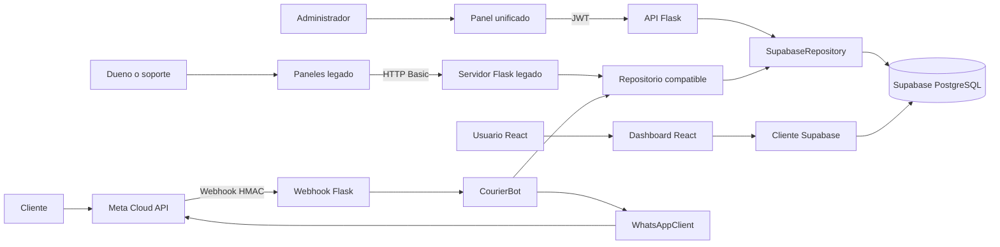
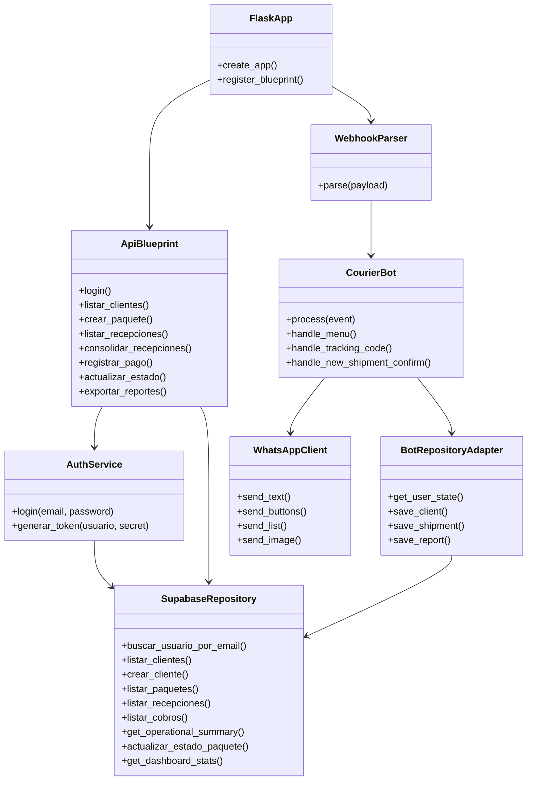

# Arquitectura de CurrierMsj

CurrierMsj integra administracion courier, seguimiento de paquetes y atencion por WhatsApp para la ruta Estados Unidos a Ecuador. El repositorio conserva la plataforma unificada y el modo operativo historico porque ambos tienen funciones activas.

## Superficies ejecutables

| Modo | Entrada | Interfaz | Acceso |
|---|---|---|---|
| Plataforma unificada | `run.py` | `frontend/index.html` | JWT HS256 y roles |
| Servidor legado | `bot-mensajeria/app.py` | `dashboard/owner.html` y `dashboard/support.html` | HTTP Basic configurable |
| Dashboard React | `dashboard/react.html` | Vite, React y Chakra UI | Proxy local o cliente Supabase publico |

Los modos unificado y legado comparten `CourierBot`, `WhatsAppClient` y la logica de conversacion. El adaptador `bot-mensajeria/services/supabase_repository.py` conserva el contrato historico del bot mientras usa el repositorio unificado cuando corresponde.

## Topologia



## Capas

| Capa | Directorio | Responsabilidad |
|---|---|---|
| Entrada y configuracion | `run.py`, `backend/config/` | Crear Flask, cargar limites, CORS y blueprints |
| Interfaces | `backend/interfaces/` | API REST, autenticacion, roles y webhook |
| Aplicacion | `backend/application/` | Autenticacion y emision de tokens |
| Infraestructura | `backend/infrastructure/` | Persistencia y consultas a Supabase |
| Seguridad compartida | `backend/security.py` | Comparacion constante, firma Meta y Basic Auth legado |
| Bot | `bot-mensajeria/bot/` | Maquina de estados y casos conversacionales |
| Dominio del bot | `bot-mensajeria/domain/` | Mensajes de entrada, estados, tarifas y servicios |
| Compatibilidad | `bot-mensajeria/services/` | Cliente de Meta y adaptacion entre esquemas |
| Datos | `database/` | Migraciones, administrador inicial y migracion historica |
| Presentacion | `frontend/`, `dashboard/` | Panel unificado, paneles HTML y dashboard React |

## Componentes principales



## Flujos

### Administracion unificada

```text
Navegador -> POST /api/auth/login -> AuthService -> usuarios en Supabase
          <- JWT de 8 horas
Navegador -> API protegida + Bearer JWT -> validacion de rol -> repositorio -> Supabase
```

### WhatsApp

```text
Meta -> POST /webhook -> firma X-Hub-Signature-256 -> parser -> CourierBot
     -> estado de sesion -> repositorio -> Supabase -> WhatsAppClient -> Meta
```

### Operacion legado

```text
Dueno/soporte -> HTTP Basic -> panel HTML -> endpoint legado
              -> repositorio compatible -> tablas historicas o esquema unificado
```

### Bodega y cobros

```text
Recepcion USA -> fotos enviadas -> decision del cliente -> despachar -> armado
              -> consolidar recepciones -> paquete CUR -> tracking publico
Pago informado -> pendiente -> verificacion de dueno/supervisor -> saldo actualizado
```

El estado de bodega es interno y no se publica como tracking. El dashboard historico del dueno conserva un modulo financiero separado, alimentado por `movimientos_financieros`, `planilla_personal` y `margenes_producto`; esas tablas se habilitan de forma idempotente con `database/legacy_upgrade/001_finance_dashboard.sql`.

## Modelo de datos

El modelo unificado esta en `database/migrations/`. Sus grupos principales son:

| Area | Tablas |
|---|---|
| Acceso | `usuarios` |
| Clientes | `clientes`, `grupos_clientes`, `mayoristas`, `prospectos` |
| Bodega USA | `recepciones_usa` |
| Logistica | `paquetes`, `tracking_events`, `imagenes_paquete`, `etiquetas_estado` |
| Cobros | `pagos_paquete` |
| Comunicacion | `sesiones_whatsapp`, `notificaciones`, `faq`, `reportes` |
| Control | `configuracion`, `audit_log`, `reportes_generados` |

La normalizacion sigue 3FN de forma practica:

- Cada entidad representa un concepto y usa una clave primaria propia.
- Las relaciones usan claves foraneas en vez de repetir datos maestros.
- El historial de tracking esta separado del paquete.
- El flujo interno de recepcion y consolidacion esta separado del tracking que ve el cliente.
- Los pagos se registran por paquete y solo afectan el saldo cuando un supervisor o administrador los verifica.
- Los grupos, mayoristas, prospectos y sesiones no se incrustan en `clientes`.
- `estado_actual` es una cache deliberada del ultimo evento para consultas operativas.
- Remitente, destinatario y direcciones quedan como fotografia historica del envio.

El archivo `bot-mensajeria/supabase_schema.sql` corresponde al esquema anterior (`envios`, `estado_usuario` y tablas financieras). Se conserva para instalaciones existentes y datos de prueba. Una instalacion nueva debe usar las migraciones `001` a `005`. Una base historica debe ejecutar primero `database/legacy_upgrade/000_preserve_historical_tables.sql` para apartar tablas con nombres incompatibles sin borrar sus datos.

## Limites de seguridad

| Limite | Control |
|---|---|
| Panel unificado a API | JWT, expiracion, roles y allowlist de campos |
| Meta a webhook | Verify token en `GET` y firma HMAC SHA-256 en `POST` |
| Panel legado a servidor | HTTP Basic sin credenciales predeterminadas |
| Datos dinamicos a HTML legado | Escape por interpolacion y allowlist DOM compartida |
| Backend a Supabase | Clave de servicio solo en servidor y RLS en base |
| Dashboard React a Supabase | Solo credenciales publicas permitidas por RLS |
| Tracking publico | Respuesta separada sin cedula, telefono ni notas internas |

El backend agrega cabeceras de seguridad, limita el cuerpo a 1 MiB, restringe CORS por origen exacto y neutraliza formulas al exportar CSV. En produccion tambien se requieren TLS, rate limiting compartido, gestion de secretos, backups y monitoreo.

## Reglas de negocio conservadas

1. La identificacion operativa del cliente usa nombre y cedula; no depende de un numero de casillero.
2. Los estados del paquete se registran como eventos de tracking.
3. Los grupos pueden asociar clientes relacionados sin duplicarlos.
4. Los envios conservan los datos historicos del remitente y destinatario.
5. Los cambios sensibles quedan disponibles para auditoria.
6. El bot no interfiere con llamadas simultaneas de WhatsApp Business.
7. Las tablas principales usan eliminacion logica donde aplica.
8. El panel financiero legado, soporte, logs y pruebas siguen siendo funcionalidades soportadas.
9. La cotizacion del bot crea una solicitud para revision humana; no promete una tarifa automatica sin validar categoria, destino, modalidad y descuentos.
10. El dinero se muestra solo a administrador y supervisor; agentes y soporte reciben indicadores operativos.
11. Quien registra un pago como agente no puede verificarlo.

## Decisiones de compatibilidad

- No se elimino `dashboard/`: contiene el proyecto React y los paneles HTML usados por el servidor legado.
- `dashboard/index.html` conserva la interfaz HTML y `dashboard/react.html` enlaza el arbol React; Vite construye ambas entradas.
- No se eliminaron los scripts de datos ni `supabase_schema.sql`: se documentaron como herramientas exclusivas del esquema historico.
- No se duplico la logica de seguridad del webhook: ambos servidores usan `backend/security.py`.
- No se obliga a ejecutar ambos servidores. Cada despliegue elige el modo necesario.
- Los modulos sin imports ni rutas activas pueden eliminarse solo despues de comprobar referencias y pruebas.

Los diagramas de casos de uso, secuencias, estados y entidad-relacion completos estan en `../README.md`.
